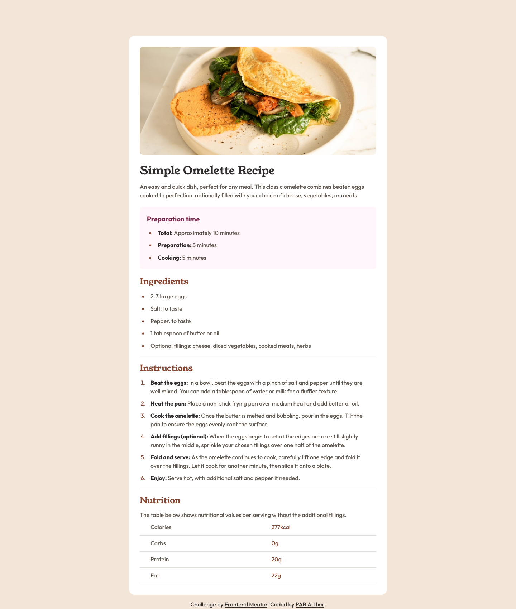

# Frontend Mentor - Recipe page solution

This is a solution to the [Recipe page challenge on Frontend Mentor](https://www.frontendmentor.io/challenges/recipe-page-KiTsR8QQKm). Frontend Mentor challenges help you improve your coding skills by building realistic projects.

## Table of contents

- [Overview](#overview)
  - [The challenge](#the-challenge)
  - [Screenshot](#screenshot)
  - [Links](#links)
- [My process](#my-process)
  - [Built with](#built-with)
  - [What I learned](#what-i-learned)
  - [Continued development](#continued-development)
  - [Useful resources](#useful-resources)
- [Author](#author)
- [Acknowledgments](#acknowledgments)

## Overview

### Screenshot



### Links

- Live Site URL: [Live Site URL](https://glittering-quokka-b33b67.netlify.app/)

## My process

### Built with

- Semantic HTML5 markup
- CSS custom properties
- Mobile-first workflow

### What I learned

- Semantic HTML: I used it to organize the content meaningfully.
- Reusable Classes: I created reusable classes like text-bold for bold text and horizontal-line for styling dividers.
- Responsive Design: I ensured the page is fully responsive.

Here’s an example of the HTML structure I’m proud of:

```html
<div class="preparation-time">
  <h3>Preparation time</h3>
  <ul>
    <li><span class="text-bold">Total:</span> Approximately 10 minutes</li>
    <li><span class="text-bold">Preparation:</span> 5 minutes</li>
    <li><span class="text-bold">Cooking:</span> 5 minutes</li>
  </ul>
</div>
```

### Continued development

CSS Grid: Experimenting with CSS Grid for more complex layouts.

Animations: Adding subtle animations to enhance user experience.

### Useful resources

- [A more Modern CSS Reset](https://piccalil.li/blog/a-more-modern-css-reset/) - This article helped me implement a modern CSS reset for consistent styling across browsers.

## Author

- Frontend Mentor - [@pabjunior](https://www.frontendmentor.io/profile/pabjunior)

## Acknowledgments

I would like to thank Frontend Mentor for providing this challenge, which helped me improve my HTML and CSS skills. Additionally, I appreciate the resources from MDN Web Docs and Piccalilli for their guidance on semantic HTML and modern CSS practices.
