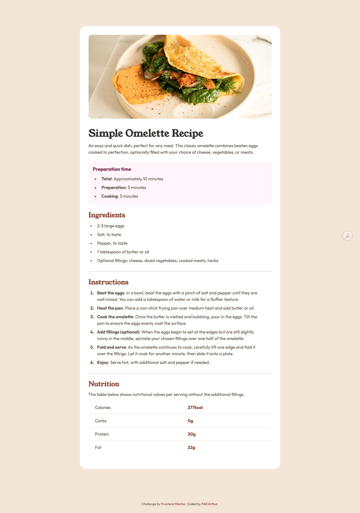

# Frontend Mentor - Recipe page solution

This is a solution to the [Recipe page challenge on Frontend Mentor](https://www.frontendmentor.io/challenges/recipe-page-KiTsR8QQKm). Frontend Mentor challenges help you improve your coding skills by building realistic projects.

## Table of contents

- [Overview](#overview)
  - [The challenge](#the-challenge)
  - [Screenshot](#screenshot)
  - [Links](#links)
- [My process](#my-process)
  - [Built with](#built-with)
  - [What I learned](#what-i-learned)
  - [Continued development](#continued-development)
  - [AI Collaboration](#ai-collaboration)
- [Author](#author)

## Overview

### The challenge

Build a recipe page that matches the provided mobile and desktop designs as closely as possible.

### Screenshot

### Links

- Solution URL: [Recipe page repo](https://github.com/pabjunior/recipe-page-main)
- Live Site URL: [Recipe page live site](https://pabjunior.github.io/recipe-page-main/)

## My process

### Built with

- Semantic HTML5 markup
- CSS custom properties
- Mobile-first workflow
- Media queries
- CSS table styling
- Google Fonts

### What I learned

This project helped me practice:

- building a page with semantic HTML sections
- using a wrapper to control spacing without pushing the image inward
- styling a table with borders and removing the last divider line
- working with a mobile-first layout and adjusting styles for desktop
- choosing meaningful class names for different parts of the page

### Continued development

In future projects, I want to keep improving:

- responsive spacing decisions
- table styling
- layout planning before writing CSS
- making breakpoint choices based on the design instead of guessing

### AI Collaboration

I used AI as a learning helper while building this project.

- It helped me break the challenge into smaller steps.
- It helped me check my HTML structure and CSS choices.
- It helped me understand where to place spacing, width, and responsive styles.
- It did not write the project for me, but it helped me think through the layout more clearly.

## Author

- Frontend Mentor - [Frontend Mentor profile](https://www.frontendmentor.io/profile/pabjunior)
- GitHub - [GitHub profile](https://github.com/pabjunior)
